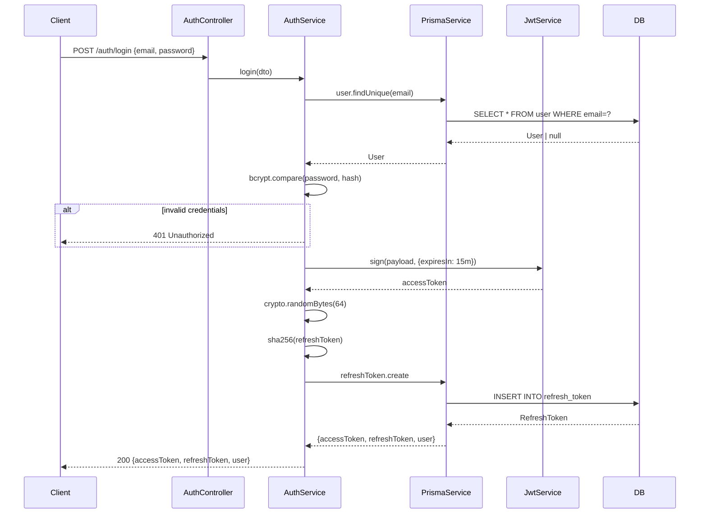
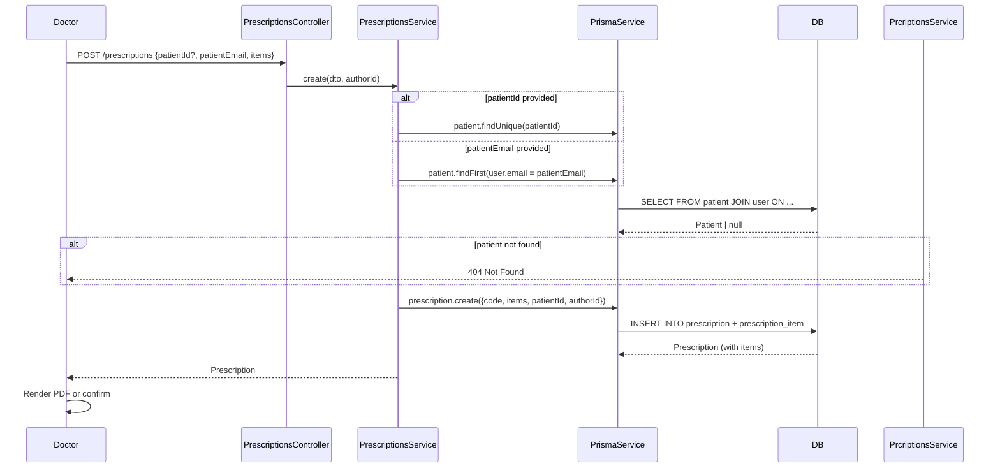

# Backend Architecture — Prescriptions App MVP

> **Language:** English (technical)
> **Status:** MVP v1.0
> **Stack:** NestJS + TypeScript + Prisma 7 + PostgreSQL

---

## 1. High-Level Architecture

```
┌─────────────────────────────────────────────────────────────┐
│                        CLIENTS                              │
│   Doctor App  ·  Patient App  ·  Admin Dashboard          │
└─────────────────────┬─────────────────────────────────────┘
                      │ HTTPS (JWT Bearer)
                      ▼
┌─────────────────────────────────────────────────────────────┐
│                    NESTJS APPLICATION                       │
│  ┌─────────────┐  ┌─────────────┐  ┌─────────────────┐    │
│  │   Global    │  │   Global    │  │    Global       │    │
│  │ ValidationPipe  │ ExceptionFilter │  ThrottlerGuard │   │
│  └─────────────┘  └─────────────┘  └─────────────────┘    │
│  ┌─────────────────────────────────────────────────────┐  │
│  │                    AUTH LAYER                        │  │
│  │  JwtAuthGuard → RolesGuard → @Roles / @CurrentUser   │  │
│  └─────────────────────────────────────────────────────┘  │
│  ┌──────────┐ ┌──────────┐ ┌──────────┐ ┌────────────┐   │
│  │  Auth    │ │  Users   │ │Patients  │ │  Doctors  │   │
│  │  Module  │ │  Module  │ │  Module  │ │  Module   │   │
│  └──────────┘ └──────────┘ └──────────┘ └────────────┘   │
│  ┌──────────────┐ ┌───────────────┐ ┌───────────────┐    │
│  │Prescriptions│ │   Metrics     │ │    Prisma     │    │
│  │   Module    │ │    Module     │ │   Module      │    │
│  └──────────────┘ └───────────────┘ └───────────────┘    │
└────────────────────────────┬────────────────────────────────┘
                             │ Prisma Pg Adapter
                             ▼
┌─────────────────────────────────────────────────────────────┐
│                    POSTGRESQL DATABASE                      │
│  User · Doctor · Patient · Prescription · RefreshToken   │
└─────────────────────────────────────────────────────────────┘
```

---

## 2. Module Overview

| Module | Responsibility | Public API |
|--------|----------------|------------|
| `AuthModule` | Login, JWT issuance, refresh rotation, logout | `/auth/*` |
| `UsersModule` | Admin user creation (doctor/patient/admin profiles) | `POST /users` |
| `PatientsModule` | Patient listing/detail | `GET /patients`, `GET /patients/:id` |
| `DoctorsModule` | Doctor listing/detail | `GET /doctors`, `GET /doctors/:id` |
| `PrescriptionsModule` | CRUD + PDF generation | `/prescriptions/*` |
| `MetricsModule` | Admin analytics | `GET /metrics` |
| `PrismaModule` | Database lifecycle (global singleton) | Injectable |

---

## 3. Data Flow

```
Request
   │
   ▼
[ThrottlerGuard] ── rate limit exceeded ──▶ 429 Too Many Requests
   │
   ▼
[ValidationPipe] ── invalid DTO ──▶ 400 Bad Request
   │
   ▼
[JwtAuthGuard] ── missing/invalid token ──▶ 401 Unauthorized
   │
   ▼
[RolesGuard] ── insufficient role ──▶ 403 Forbidden
   │
   ▼
[Controller] ── delegates to ──▶ [Service] ── queries ──▶ [PrismaService]
   │
   ▼
[HttpExceptionFilter] ── formats error ──▶ JSON response
```

---

## 4. ER Diagram

```mermaid
erDiagram
    USER ||--o| DOCTOR : "1:1 optional"
    USER ||--o| PATIENT : "1:1 optional"
    USER {
        string id PK
        string email UK
        string password
        string name
        enum role
        datetime createdAt
        datetime updatedAt
    }
    DOCTOR {
        string id PK
        string userId FK UK
        string specialty
    }
    PATIENT {
        string id PK
        string userId FK UK
        datetime birthDate
    }
    DOCTOR ||--o{ PRESCRIPTION : "authors"
    PATIENT ||--o{ PRESCRIPTION : "receives"
    PRESCRIPTION {
        string id PK
        string code UK
        enum status
        string notes
        datetime createdAt
        datetime updatedAt
        datetime consumedAt
        string patientId FK
        string authorId FK
    }
    PRESCRIPTION ||--o{ PRESCRIPTION_ITEM : "contains"
    PRESCRIPTION_ITEM {
        string id PK
        string prescriptionId FK
        string name
        string dosage
        int quantity
        string instructions
    }
    USER ||--o{ REFRESH_TOKEN : "holds"
    REFRESH_TOKEN {
        string id PK
        string tokenHash
        string userId FK
        datetime revokedAt
        datetime expiresAt
        datetime createdAt
    }
```

---

## 5. Prisma Schema (Source of Truth)

```prisma
generator client {
  provider     = "prisma-client"
  output       = "../generated/prisma"
  moduleFormat = "cjs"
}

datasource db {
  provider = "postgresql"
}

enum Role {
  admin
  doctor
  patient
}

enum PrescriptionStatus {
  pending
  consumed
}

model User {
  id            String          @id @default(cuid())
  email         String          @unique
  password      String
  name          String
  role          Role
  createdAt     DateTime        @default(now())
  updatedAt     DateTime        @updatedAt

  doctor        Doctor?
  patient       Patient?
  refreshTokens RefreshToken[]

  @@index([role])
}

model Doctor {
  id             String          @id @default(cuid())
  user           User            @relation(fields: [userId], references: [id], onDelete: Cascade)
  userId         String          @unique
  specialty      String?
  prescriptions Prescription[]  @relation("AuthoredBy")
}

model Patient {
  id             String          @id @default(cuid())
  user           User            @relation(fields: [userId], references: [id], onDelete: Cascade)
  userId         String          @unique
  birthDate      DateTime?
  prescriptions Prescription[]
}

model Prescription {
  id          String              @id @default(cuid())
  code        String              @unique
  status      PrescriptionStatus  @default(pending)
  notes       String?
  createdAt   DateTime            @default(now())
  updatedAt   DateTime            @updatedAt
  consumedAt  DateTime?

  patient     Patient            @relation(fields: [patientId], references: [id])
  patientId   String
  author      Doctor             @relation("AuthoredBy", fields: [authorId], references: [id])
  authorId    String
  items       PrescriptionItem[]

  @@index([status, createdAt])
  @@index([patientId])
  @@index([authorId])
  @@index([createdAt])
}

model PrescriptionItem {
  id             String        @id @default(cuid())
  prescription   Prescription  @relation(fields: [prescriptionId], references: [id], onDelete: Cascade)
  prescriptionId String
  name           String
  dosage         String?
  quantity       Int?
  instructions   String?
}

model RefreshToken {
  id         String    @id @default(cuid())
  tokenHash  String
  user       User      @relation(fields: [userId], references: [id], onDelete: Cascade)
  userId     String
  revokedAt DateTime?
  expiresAt DateTime
  createdAt  DateTime  @default(now())

  @@index([userId])
}
```

---

## 6. API Endpoints

### 6.1 Auth

| Method | Path | Description | Auth |
|--------|------|-------------|------|
| `POST` | `/auth/login` | Email + password login | Public |
| `POST` | `/auth/refresh` | Rotate access token | Public* |
| `POST` | `/auth/logout` | Revoke refresh token | JWT |
| `GET` | `/auth/me` | Current user profile | JWT |

> `*` Public = requires refresh token in body, not JWT

### 6.2 Users

| Method | Path | Description | Auth |
|--------|------|-------------|------|
| `POST` | `/users` | Create user (admin only) | admin |

### 6.3 Patients

| Method | Path | Description | Auth |
|--------|------|-------------|------|
| `GET` | `/patients` | List all patients | admin, doctor |
| `GET` | `/patients/:id` | Patient detail | admin, doctor |

### 6.4 Doctors

| Method | Path | Description | Auth |
|--------|------|-------------|------|
| `GET` | `/doctors` | List all doctors | admin |
| `GET` | `/doctors/:id` | Doctor detail | admin |

### 6.5 Prescriptions

| Method | Path | Description | Auth |
|--------|------|-------------|------|
| `POST` | `/prescriptions` | Create prescription | doctor |
| `GET` | `/prescriptions` | List (filter+pagination) | by role |
| `GET` | `/prescriptions/:id` | Prescription detail | owner or admin |
| `PATCH` | `/prescriptions/:id/consume` | Mark as consumed | patient owner |
| `GET` | `/prescriptions/:id/pdf` | Download PDF | owner or admin |

### 6.6 Metrics

| Method | Path | Description | Auth |
|--------|------|-------------|------|
| `GET` | `/metrics` | Aggregated analytics | admin |

---

## 7. Pagination & Filtering

```
GET /prescriptions?page=1&limit=10&status=pending&from=2026-05-01&to=2026-05-13&sort=createdAt&order=desc
```

**Defaults:** `page=1`, `limit=10`, `sort=createdAt`, `order=desc`

**Response:**

```json
{
  "data": [...],
  "meta": {
    "page": 1,
    "limit": 10,
    "total": 35,
    "totalPages": 4
  }
}
```

---

## 8. RBAC Matrix

| Action | admin | doctor | patient |
|--------|-------|--------|---------|
| Login | ✓ | ✓ | ✓ |
| View own profile | ✓ | ✓ | ✓ |
| Create user | ✓ | ✗ | ✗ |
| List patients | ✓ | ✓ | ✗ |
| Patient detail | ✓ | ✓ | ✗ |
| List doctors | ✓ | ✗ | ✗ |
| Doctor detail | ✓ | ✗ | ✗ |
| Create prescription | ✗ | ✓ | ✗ |
| List own prescriptions | ✗ | authored | received |
| Prescription detail | ✓ | authored | received |
| Mark consumed | ✗ | ✗ | ✓ (owner) |
| Download PDF | ✓ | authored | received |
| View metrics | ✓ | ✗ | ✗ |

---

## 9. Auth Flow (Sequence Diagram)



---

## 10. Prescription Creation Flow



---

## 11. Folder Structure

```
backend/
├── src/
│   ├── main.ts                     # Entry point, ValidationPipe, listen()
│   ├── app.module.ts               # Root module
│   │
│   ├── auth/
│   │   ├── auth.module.ts
│   │   ├── auth.controller.ts    # /auth/*
│   │   ├── auth.service.ts        # login/refresh/logout/getMe
│   │   ├── dto/
│   │   │   ├── login.dto.ts
│   │   │   └── refresh-token.dto.ts
│   │   ├── strategies/
│   │   │   ├── jwt.strategy.ts
│   │   │   └── refresh-token.strategy.ts
│   │   ├── guards/
│   │   │   ├── jwt-auth.guard.ts
│   │   │   └── roles.guard.ts
│   │   └── decorators/
│   │       ├── roles.decorator.ts
│   │       └── current-user.decorator.ts
│   │
│   ├── users/
│   │   ├── users.module.ts
│   │   ├── users.controller.ts     # POST /users
│   │   ├── users.service.ts       # create with doctor/patient profile
│   │   └── dto/
│   │       └── create-user.dto.ts
│   │
│   ├── patients/
│   │   ├── patients.module.ts
│   │   ├── patients.controller.ts # GET /patients, GET /patients/:id
│   │   └── patients.service.ts
│   │
│   ├── doctors/
│   │   ├── doctors.module.ts
│   │   ├── doctors.controller.ts  # GET /doctors, GET /doctors/:id
│   │   └── doctors.service.ts
│   │
│   ├── prescriptions/
│   │   ├── prescriptions.module.ts
│   │   ├── prescriptions.controller.ts  # /prescriptions/*
│   │   ├── prescriptions.service.ts     # CRUD + PDF generation
│   │   └── dto/
│   │       ├── create-prescription.dto.ts
│   │       └── pagination.dto.ts
│   │
│   ├── metrics/
│   │   ├── metrics.module.ts
│   │   ├── metrics.controller.ts # GET /metrics
│   │   └── metrics.service.ts     # Aggregated queries
│   │
│   ├── prisma/
│   │   ├── prisma.module.ts       # @Global()
│   │   └── prisma.service.ts      # Singleton PrismaClient
│   │
│   └── common/
│       ├── guards/
│       │   └── http-exception.filter.ts
│       └── interceptors/
│           └── logging.interceptor.ts
│
├── prisma/
│   ├── schema.prisma
│   └── seed.ts                    # 3 users + sample prescriptions
│
├── generated/
│   └── prisma/                   # Prisma Client output (moduleFormat=cjs)
│
├── test/
│   ├── app.e2e-spec.ts
│   └── jest-e2e.json
│
├── docs/                          # This documentation
│   ├── ARCHITECTURE.md            # This file
│   ├── API_CONTRACTS.md
│   ├── SECURITY_MODEL.md
│   └── IMPLEMENTATION_ROADMAP.md
│
├── package.json
├── tsconfig.json
├── nest-cli.json
└── .gitignore
```

---

## 12. Security Model

### 12.1 Token Strategy

| Token | Lifetime | Storage | Transport |
|-------|----------|---------|-----------|
| Access Token | 15 minutes | Memory (client) | Bearer header |
| Refresh Token | 7 days | DB (hashed) | Body only |

### 12.2 Password Storage

- **Algorithm:** bcrypt, cost factor 10
- **Never stored** in plain text or hashed with SHA (except in seed for testing)

### 12.3 HTTP Security Headers

| Header | Value | Purpose |
|--------|-------|---------|
| `X-Content-Type-Options` | `nosniff` | Prevent MIME sniffing |
| `X-Frame-Options` | `DENY` | Prevent clickjacking |
| `X-XSS-Protection` | `1; mode=block` | XSS filter (legacy) |
| `Strict-Transport-Security` | `max-age=31536000` | Force HTTPS |
| `Content-Security-Policy` | `default-src 'none'` | CSP strict |

### 12.4 Threat Mitigation

| Threat | Mitigation |
|--------|------------|
| SQL Injection | Prisma parameterized queries only |
| Password brute force | Rate limit on `/auth/login` (5 req/min) |
| Token replay | Refresh token hash in DB + revocation |
| IDOR | Service-layer ownership checks (owner/admin only) |
| Data exposure | `ValidationPipe whitelist:true` strips unknown fields |
| CSRF | `SameSite=Strict` on future cookie (if used) |

---

## 13. Error Response Format

All errors follow RFC 7807 Problem Details:

```json
{
  "statusCode": 404,
  "message": "Patient not found",
  "error": "Not Found",
  "timestamp": "2026-05-13T12:00:00.000Z",
  "path": "/patients/invalid-id"
}
```

---

## 14. Implementation Phases

| Phase | Focus | Deliverable |
|-------|-------|-------------|
| **Phase 1** | Infrastructure | NestJS scaffold + Prisma + DB |
| **Phase 2** | Data Modeling | Schema applied + seed data |
| **Phase 3** | Auth Layer | JWT + refresh + guards + decorators |
| **Phase 4** | Core Business | Users, Patients, Doctors, Prescriptions modules |
| **Phase 5** | PDF & Metrics | PDF generation + admin metrics |
| **Phase 6** | Testing | Unit tests + E2E |
| **Phase 7** | Deploy | Railway/Render + Vercel frontend |

---

## 15. Environment Variables

| Variable | Description | Default |
|----------|-------------|---------|
| `DATABASE_URL` | PostgreSQL connection string | `postgresql://...` |
| `JWT_SECRET` | Access token signing secret | `changeme` |
| `JWT_REFRESH_SECRET` | Refresh token signing secret | `changeme-refresh` |
| `PORT` | HTTP server port | `3000` |

---

## 16. Dependencies (Production)

| Package | Version | Purpose |
|---------|---------|---------|
| `@nestjs/core` | ^11 | Framework core |
| `@nestjs/jwt` | ^11 | JWT module |
| `@nestjs/passport` | ^11 | Auth strategy support |
| `@prisma/client` | ^7 | Database client |
| `@prisma/adapter-pg` | ^7 | PostgreSQL adapter |
| `passport-jwt` | ^4 | JWT passport strategy |
| `bcrypt` | ^5 | Password hashing |
| `pdfkit` | ^0.18 | PDF generation |
| `class-validator` | ^0.14 | DTO validation |
| `class-transformer` | ^0.5 | Object transformation |