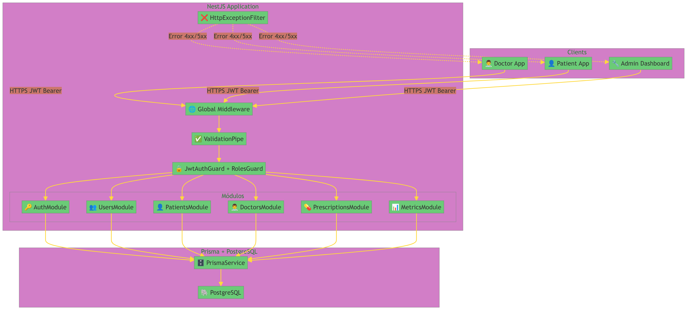
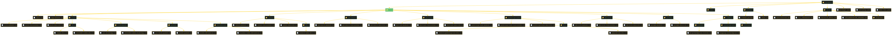
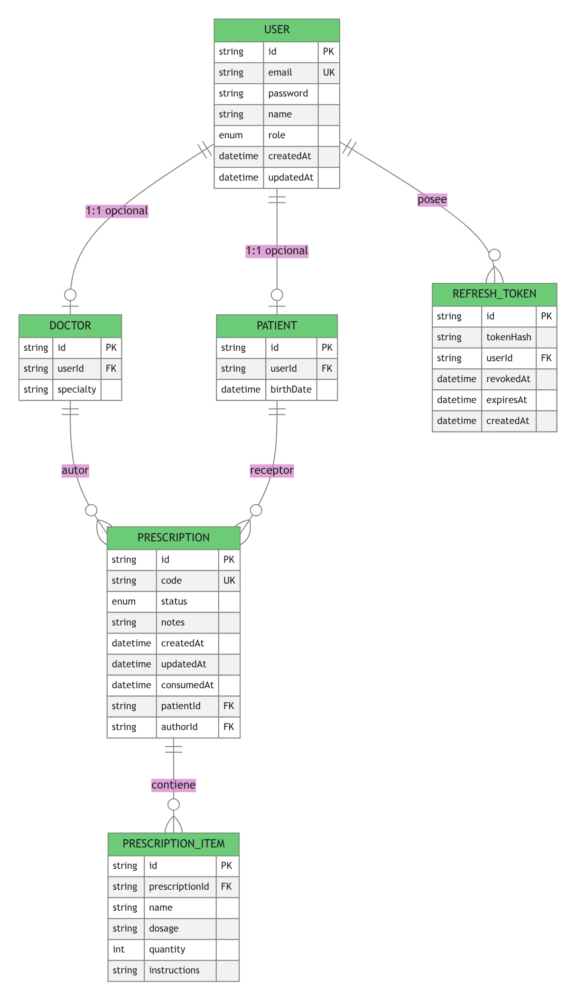
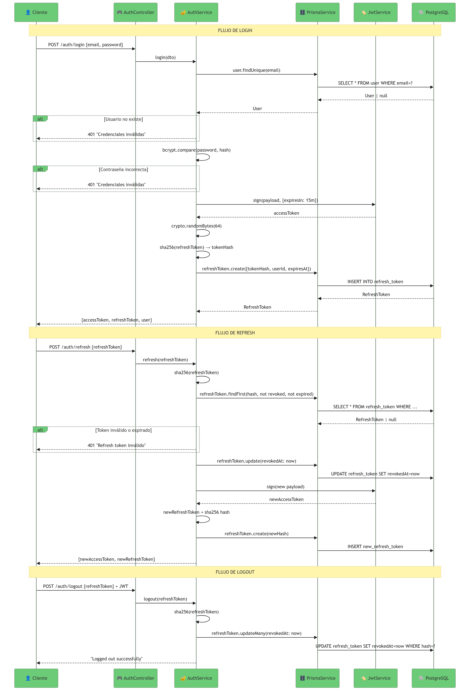
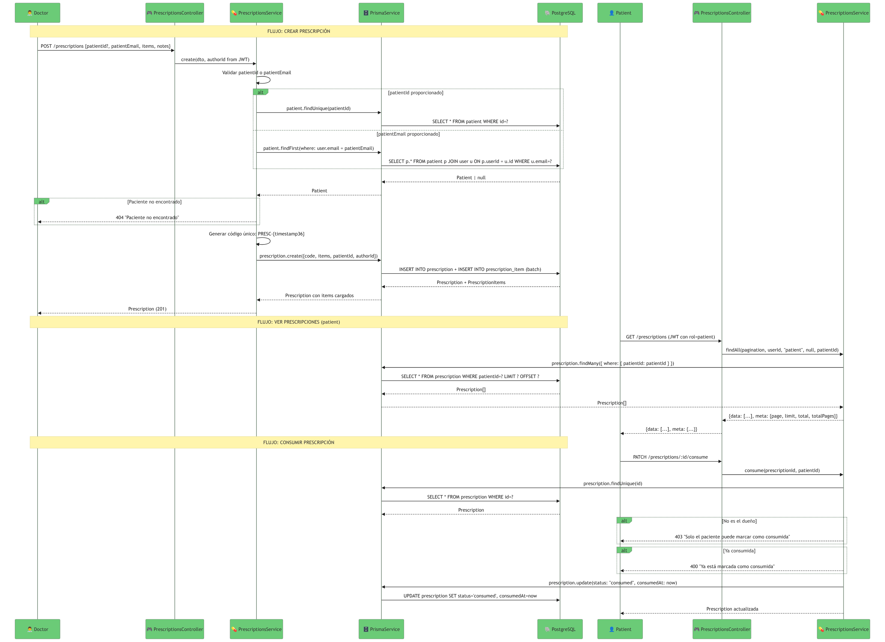
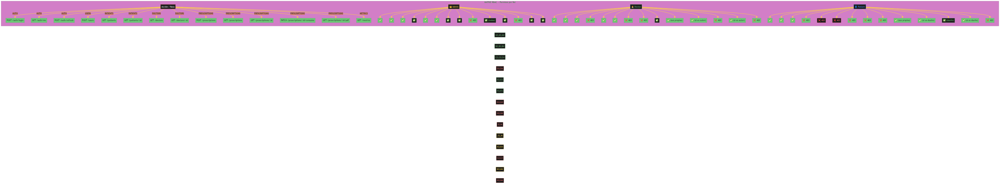

# Arquitectura del Backend — App de Prescripciones MVP

> **Idioma:** Español
> **Estado:** MVP v1.0
> **Stack:** NestJS + TypeScript + Prisma 7 + PostgreSQL

---

## 1. Visión General de la Arquitectura

```
┌─────────────────────────────────────────────────────────────┐
│                        CLIENTES                            │
│   App Doctor  ·  App Paciente  ·  Dashboard Admin          │
└──────────────────────┬────────────────────────────────────┘
                       │ HTTPS (JWT Bearer)
                       ▼
┌─────────────────────────────────────────────────────────────┐
│                    NESTJS APPLICATION                      │
│  ┌─────────────┐  ┌─────────────┐  ┌─────────────────┐    │
│  │   Global    │  │   Global    │  │    Global       │    │
│  │ Middleware  │  │ ValidationPipe│  │ ThrottlerGuard │    │
│  └─────────────┘  └─────────────┘  └─────────────────┘    │
│  ┌─────────────────────────────────────────────────────┐  │
│  │                    CAPA DE AUTENTICACIÓN               │  │
│  │  JwtAuthGuard → RolesGuard → @Roles / @CurrentUser    │  │
│  └─────────────────────────────────────────────────────┘  │
│  ┌──────────┐ ┌──────────┐ ┌──────────┐ ┌────────────┐   │
│  │  Auth    │ │  Users   │ │Patients  │ │  Doctors  │   │
│  │  Module  │ │  Module  │ │  Module  │ │  Module   │   │
│  └──────────┘ └──────────┘ └──────────┘ └────────────┘   │
│  ┌──────────────┐ ┌───────────────┐ ┌───────────────┐    │
│  │Prescriptions │ │   Metrics     │ │    Prisma     │    │
│  │   Module    │ │    Module     │ │   Module      │    │
│  └──────────────┘ └───────────────┘ └───────────────┘    │
└────────────────────────────┬────────────────────────────────┘
                             │ Prisma Pg Adapter
                             ▼
┌─────────────────────────────────────────────────────────────┐
│                    POSTGRESQL DATABASE                     │
│  User · Doctor · Patient · Prescription · RefreshToken    │
└─────────────────────────────────────────────────────────────┘
```



---

## 2. Estructura de Carpetas



```
backend/
├── src/
│   ├── main.ts                     # Entry point, ValidationPipe, listen()
│   ├── app.module.ts               # Root module
│   │
│   ├── auth/
│   │   ├── auth.module.ts
│   │   ├── auth.controller.ts    # /auth/*
│   │   ├── auth.service.ts        # login/refresh/logout/getMe
│   │   ├── dto/
│   │   │   ├── login.dto.ts
│   │   │   └── refresh-token.dto.ts
│   │   ├── strategies/
│   │   │   ├── jwt.strategy.ts
│   │   │   └── refresh-token.strategy.ts
│   │   ├── guards/
│   │   │   ├── jwt-auth.guard.ts
│   │   │   └── roles.guard.ts
│   │   └── decorators/
│   │       ├── roles.decorator.ts
│   │       └── current-user.decorator.ts
│   │
│   ├── users/
│   │   ├── users.module.ts
│   │   ├── users.controller.ts     # POST /users
│   │   ├── users.service.ts       # create with doctor/patient profile
│   │   └── dto/
│   │       └── create-user.dto.ts
│   │
│   ├── patients/
│   │   ├── patients.module.ts
│   │   ├── patients.controller.ts # GET /patients, GET /patients/:id
│   │   └── patients.service.ts
│   │
│   ├── doctors/
│   │   ├── doctors.module.ts
│   │   ├── doctors.controller.ts  # GET /doctors, GET /doctors/:id
│   │   └── doctors.service.ts
│   │
│   ├── prescriptions/
│   │   ├── prescriptions.module.ts
│   │   ├── prescriptions.controller.ts  # /prescriptions/*
│   │   ├── prescriptions.service.ts     # CRUD + PDF generation
│   │   └── dto/
│   │       ├── create-prescription.dto.ts
│   │       └── pagination.dto.ts
│   │
│   ├── metrics/
│   │   ├── metrics.module.ts
│   │   ├── metrics.controller.ts # GET /metrics
│   │   └── metrics.service.ts     # Aggregated queries
│   │
│   ├── prisma/
│   │   ├── prisma.module.ts       # @Global()
│   │   └── prisma.service.ts      # Singleton PrismaClient
│   │
│   └── common/
│       ├── guards/
│       │   └── http-exception.filter.ts
│       └── interceptors/
│           └── logging.interceptor.ts
│
├── prisma/
│   ├── schema.prisma
│   └── seed.ts                    # 3 usuarios + prescripciones ejemplo
│
├── docs/
│   └── diagrams/                   # Diagramas PNG generados
│
├── package.json
├── tsconfig.json
├── nest-cli.json
└── .gitignore
```

---

## 3. Modelo de Datos (Schema Prisma)

```prisma
generator client {
  provider     = "prisma-client"
  output       = "../generated/prisma"
  moduleFormat = "cjs"
}

datasource db {
  provider = "postgresql"
}

enum Role {
  admin
  doctor
  patient
}

enum PrescriptionStatus {
  pending
  consumed
}

model User {
  id            String          @id @default(cuid())
  email         String          @unique
  password      String
  name          String
  role          Role
  createdAt     DateTime        @default(now())
  updatedAt     DateTime        @updatedAt

  doctor        Doctor?
  patient       Patient?
  refreshTokens RefreshToken[]

  @@index([role])
}

model Doctor {
  id             String          @id @default(cuid())
  user           User            @relation(fields: [userId], references: [id], onDelete: Cascade)
  userId         String          @unique
  specialty      String?
  prescriptions Prescription[]  @relation("AuthoredBy")
}

model Patient {
  id             String          @id @default(cuid())
  user           User            @relation(fields: [userId], references: [id], onDelete: Cascade)
  userId         String          @unique
  birthDate      DateTime?
  prescriptions Prescription[]
}

model Prescription {
  id          String              @id @default(cuid())
  code        String              @unique
  status      PrescriptionStatus  @default(pending)
  notes       String?
  createdAt   DateTime            @default(now())
  updatedAt   DateTime            @updatedAt
  consumedAt  DateTime?

  patient     Patient            @relation(fields: [patientId], references: [id])
  patientId   String
  author      Doctor             @relation("AuthoredBy", fields: [authorId], references: [id])
  authorId    String
  items       PrescriptionItem[]

  @@index([status, createdAt])
  @@index([patientId])
  @@index([authorId])
  @@index([createdAt])
}

model PrescriptionItem {
  id             String        @id @default(cuid())
  prescription   Prescription  @relation(fields: [prescriptionId], references: [id], onDelete: Cascade)
  prescriptionId String
  name           String
  dosage         String?
  quantity       Int?
  instructions   String?
}

model RefreshToken {
  id         String    @id @default(cuid())
  tokenHash  String
  user       User      @relation(fields: [userId], references: [id], onDelete: Cascade)
  userId     String
  revokedAt  DateTime?
  expiresAt  DateTime
  createdAt  DateTime  @default(now())

  @@index([userId])
}
```

---

## 4. Diagrama Entidad-Relación



---

## 5. Endpoints de la API

### 5.1 Auth

| Método | Ruta | Descripción | Auth |
|--------|------|-------------|------|
| `POST` | `/auth/login` | Login email/password | Público |
| `POST` | `/auth/refresh` | Rotar access token | Público* |
| `POST` | `/auth/logout` | Revocar refresh token | JWT |
| `GET` | `/auth/me` | Perfil usuario actual | JWT |

> `*` Público = requiere refresh token en body, no JWT

### 5.2 Users

| Método | Ruta | Descripción | Auth |
|--------|------|-------------|------|
| `POST` | `/users` | Crear usuario | admin |

### 5.3 Patients

| Método | Ruta | Descripción | Auth |
|--------|------|-------------|------|
| `GET` | `/patients` | Listar todos | admin, doctor |
| `GET` | `/patients/:id` | Detalle | admin, doctor |

### 5.4 Doctors

| Método | Ruta | Descripción | Auth |
|--------|------|-------------|------|
| `GET` | `/doctors` | Listar médicos | admin |
| `GET` | `/doctors/:id` | Detalle | admin |

### 5.5 Prescriptions

| Método | Ruta | Descripción | Auth |
|--------|------|-------------|------|
| `POST` | `/prescriptions` | Crear prescripción | doctor |
| `GET` | `/prescriptions` | Listar (filtro+paginación) | por rol |
| `GET` | `/prescriptions/:id` | Detalle | dueño o admin |
| `PATCH` | `/prescriptions/:id/consume` | Marcar como consumida | patient dueño |
| `GET` | `/prescriptions/:id/pdf` | Descargar PDF | dueño o admin |

### 5.6 Metrics

| Método | Ruta | Descripción | Auth |
|--------|------|-------------|------|
| `GET` | `/metrics` | Analytics agregados | admin |

---

## 6. Flujo de Autenticación



---

## 7. Flujo de Prescripción



---

## 8. Matriz RBAC



| Acción | admin | doctor | patient |
|--------|:-----:|:------:|:-------:|
| Login | ✓ | ✓ | ✓ |
| Ver propio perfil | ✓ | ✓ | ✓ |
| Crear usuario | ✓ | ✗ | ✗ |
| Listar pacientes | ✓ | ✓ | ✗ |
| Detalle paciente | ✓ | ✓ | ✗ |
| Listar médicos | ✓ | ✗ | ✗ |
| Crear prescripción | ✗ | ✓ | ✗ |
| Listar propias | ✗ | las que autoró | las que recibió |
| Detalle prescripción | ✓ | si es autor | si es dueño |
| Marcar consumida | ✗ | ✗ | ✓ (dueño) |
| Descargar PDF | ✓ | si autor | si dueño |
| Ver métricas | ✓ | ✗ | ✗ |

---

## 9. Paginación y Filtros

```
GET /prescriptions?page=1&limit=10&status=pending&from=2026-05-01&to=2026-05-13&sort=createdAt&order=desc
```

**Valores por defecto:** `page=1`, `limit=10`, `sort=createdAt`, `order=desc`

**Respuesta:**

```json
{
  "data": [...],
  "meta": {
    "page": 1,
    "limit": 10,
    "total": 35,
    "totalPages": 4
  }
}
```

---

## 10. Variables de Entorno

| Variable | Descripción | Default |
|----------|-------------|---------|
| `DATABASE_URL` | Connection string PostgreSQL | `postgresql://...` |
| `JWT_SECRET` | Secreto para firmar access tokens | `changeme` |
| `JWT_REFRESH_SECRET` | Secreto para refresh tokens | `changeme-refresh` |
| `PORT` | Puerto HTTP del servidor | `3000` |

---

## 11. Dependencias de Producción

| Paquete | Versión | Propósito |
|---------|---------|-----------|
| `@nestjs/core` | ^11 | Framework core |
| `@nestjs/jwt` | ^11 | Módulo JWT |
| `@nestjs/passport` | ^11 | Soporte estrategias auth |
| `@prisma/client` | ^7 | Cliente de base de datos |
| `@prisma/adapter-pg` | ^7 | Adapter PostgreSQL |
| `passport-jwt` | ^4 | Estrategia JWT para passport |
| `bcrypt` | ^5 | Hashing de passwords |
| `pdfkit` | ^0.18 | Generación de PDF |
| `class-validator` | ^0.14 | Validación de DTOs |
| `class-transformer` | ^0.5 | Transformación de objetos |

---

## 12. Fases de Implementación

| Fase | Nombre | Días | Entregable |
|------|--------|------|-------------|
| **Fase 1** | Infraestructura | 1 | NestJS scaffold + Prisma + DB |
| **Fase 2** | Modelo de Datos | 1 | Schema aplicado + seed data |
| **Fase 3** | Capa de Auth | 2 | JWT + refresh + guards + decorators |
| **Fase 4** | Lógica de Negocio | 3 | Users, Patients, Doctors, Prescriptions |
| **Fase 5** | PDF y Métricas | 1 | Generación PDF + admin metrics |
| **Fase 6** | Testing | 2 | Unit tests + E2E |
| **Fase 7** | Deploy | 2 | Railway/Render + CI/CD |