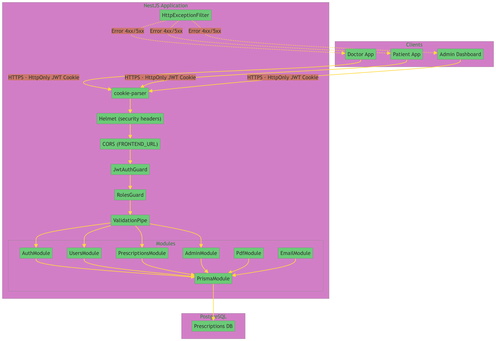
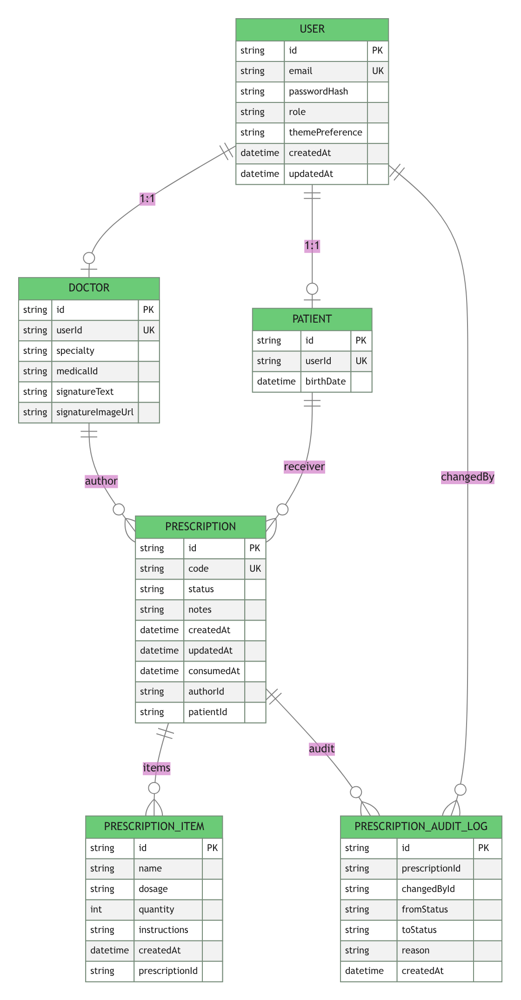
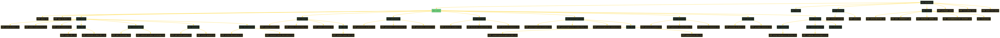

# Arquitectura — Prescriptions App

## 1. Visión General

```
┌─────────────────────────────────────────────────────────────┐
│  Doctor App  ·  Patient App  ·  Admin Dashboard           │
└──────────────────────┬─────────────────────────────────┘
                         │ HTTPS (JWT HttpOnly cookies)
┌───────────────────────▼─────────────────────────────────┐
│                    NESTJS APPLICATION                      │
│                                                         │
│  ┌──────────────┐  ┌────────────────┐  ┌─────────────┐  │
│  │  Helmet      │  │ ValidationPipe  │  │    CORS     │  │
│  │  (headers)   │  │ whitelist+      │  │ pinned to   │  │
│  └──────────────┘  └────────────────┘  │ FRONTEND_URL │  │
│                                        └─────────────┘  │
│  ┌──────────────────────────────────────────────────┐   │
│  │     JwtAuthGuard (cookie) → RolesGuard            │   │
│  │     @CurrentUser()  @Roles()                       │   │
│  └──────────────────────────────────────────────────┘   │
│                                                         │
│  ┌──────────┐ ┌──────────┐ ┌───────────┐ ┌──────────┐  │
│  │  Auth    │ │  Users   │ │Prescrip-  │ │  Admin   │  │
│  │  Module  │ │  Module  │ │  tions    │ │  Module  │  │
│  └──────────┘ └──────────┘ └───────────┘ └──────────┘  │
│  ┌──────────┐                                           │
│  │   PDF   │  (Puppeteer + Handlebars)                  │
│  └──────────┘                                           │
└─────────────────────────────┬─────────────────────────────┘
                             │ Prisma Client
┌─────────────────────────────▼───────────────────────────┐
│                    POSTGRESQL DATABASE                   │
│  User · Prescription                                    │
└─────────────────────────────────────────────────────────┘
```



---

## 2. Modelo de Datos

El schema Prisma es la **única fuente de verdad** del modelo de datos. No existen tablas Doctor, Patient, RefreshToken ni PrescriptionItem separadas.

```prisma
generator client {
  provider = "prisma-client-js"
}

datasource db {
  provider = "postgresql"
  url      = env("DATABASE_URL")
}

enum Role {
  ADMIN
  DOCTOR
  PATIENT
}

enum PrescriptionStatus {
  PENDING
  CONSUMED
}

model User {
  id             String         @id @default(uuid())
  email          String         @unique
  passwordHash   String
  role           Role
  createdAt      DateTime       @default(now())
  updatedAt      DateTime       @updatedAt

  prescriptionsAsDoctor   Prescription[] @relation("DoctorPrescriptions")
  prescriptionsAsPatient Prescription[] @relation("PatientPrescriptions")

  @@index([email])
}

model Prescription {
  id          String             @id @default(uuid())
  status      PrescriptionStatus @default(PENDING)

  items       Json

  notes       String?
  createdAt   DateTime           @default(now())
  updatedAt   DateTime           @updatedAt

  doctorId    String
  doctor      User @relation("DoctorPrescriptions", fields: [doctorId], references: [id])

  patientId   String
  patient     User @relation("PatientPrescriptions", fields: [patientId], references: [id])

  @@index([status])
  @@index([createdAt])
  @@index([doctorId])
  @@index([patientId])
}
```

### Relaciones

- Un `User` con rol `DOCTOR` puede authored无数 `Prescription` (relación `prescriptionsAsDoctor`)
- Un `User` con rol `PATIENT` puede recibir无数 `Prescription` (relación `prescriptionsAsPatient`)
- Los roles `ADMIN`, `DOCTOR`, `PATIENT` viven en `User.role` — no hay tabla separada
- Los items de la prescripción se almacenan como `Json` — array de `{name, dosage, instructions}`



---

## 3. Estructura de Carpetas

```
backend/
├── src/
│   ├── main.ts                       # Entry point, ValidationPipe, Swagger
│   ├── app.module.ts                 # Root module
│   │
│   ├── auth/                         # Login, logout, refresh, profile
│   │   ├── auth.module.ts
│   │   ├── auth.controller.ts
│   │   ├── auth.service.ts
│   │   ├── strategies/
│   │   │   ├── jwt.strategy.ts
│   │   │   └── refresh-token.strategy.ts
│   │   ├── guards/
│   │   │   ├── jwt-auth.guard.ts
│   │   │   └── roles.guard.ts
│   │   └── decorators/
│   │       ├── roles.decorator.ts
│   │       └── current-user.decorator.ts
│   │
│   ├── users/                        # User management + patient/doctor listing
│   │   ├── users.module.ts
│   │   ├── users.controller.ts
│   │   └── users.service.ts
│   │
│   ├── prescriptions/                 # Prescription CRUD + consume + PDF
│   │   ├── prescriptions.module.ts
│   │   ├── prescriptions.controller.ts
│   │   └── prescriptions.service.ts
│   │
│   ├── admin/                         # Admin-only: metrics + all prescriptions
│   │   ├── admin.module.ts
│   │   ├── admin.controller.ts
│   │   └── admin.service.ts
│   │
│   ├── pdf/                          # Puppeteer PDF generation
│   │   └── pdf.service.ts
│   │
│   ├── prisma/                       # Singleton PrismaClient
│   │   ├── prisma.module.ts
│   │   └── prisma.service.ts
│   │
│   ├── config/
│   │   └── env.validation.ts
│   │
│   └── common/
│       └── filters/
│           └── http-exception.filter.ts
│
├── prisma/
│   ├── schema.prisma
│   └── seed.ts
│
└── test/
    └── *.e2e-spec.ts
```



---

## 4. Decisiones Clave de Arquitectura

### 4.1 Auth Cookie-Based

Los tokens JWT se almacenan en **HttpOnly cookies** — nunca expuestos a JavaScript.

- `accessToken` — 15 min TTL
- `refreshToken` — 7 dias TTL
- No hay Bearer token en Authorization header
- Swagger UI configurado con `withCredentials: true`

### 4.2 IDOR Prevention

Los ownership checks viven en la **capa de servicio**, no en el controller.

```typescript
const prescription = await this.prisma.prescription.findFirst({
  where: {
    id: prescriptionId,
    ...(role === 'PATIENT' ? { patientId: currentUser.id } : {}),
    ...(role === 'DOCTOR'  ? { doctorId: currentUser.id } : {}),
  },
});
```

Se usa `findFirst` (no `findUnique`) porque no existe unique constraint en patientId+doctorId.

### 4.3 No Separate Doctor/Patient Tables

Los roles viven en `User.role`. Esto simplifica:
- No hay join entre User y Doctor/Patient
- Auth es un solo `User`, no múltiples perfiles
- Queries más simples en Prisma

### 4.4 Items as Json

`Prescription.items` es un campo `Json` — array de objetos `{name, dosage, instructions}`. No hay catálogo de productos.

---

## 5. Middleware Global (main.ts)

Todo request pasa por:

1. **Helmet** — Security headers (X-Frame-Options DENY, nosniff, XSS, etc.)
2. **Custom securityHeadersMiddleware** — no-store cache control
3. **cookieParser** — Parseo de cookies para auth
4. **CORS** — Origen pinned a `FRONTEND_URL` con `credentials: true`
5. **ValidationPipe** — `whitelist: true`, `forbidNonWhitelisted: true`, `transform: true`
6. **HttpExceptionFilter** — JSON error format consistente

---

## 6. Variables de Entorno

| Variable | Descripcion | Ejemplo |
|----------|-------------|---------|
| `DATABASE_URL` | PostgreSQL connection string (puerto 5433) | `postgresql://...` |
| `JWT_ACCESS_SECRET` | Secreto para access tokens | `openssl rand -base64 32` |
| `JWT_REFRESH_SECRET` | Secreto para refresh tokens | `openssl rand -base64 32` |
| `JWT_ACCESS_TTL` | TTL access token (string) | `"15m"` |
| `JWT_REFRESH_TTL` | TTL refresh token (string) | `"7d"` |
| `PORT` | Puerto HTTP | `3000` |
| `FRONTEND_URL` | Origen CORS | `http://localhost:3001` |
| `NODE_ENV` | Entorno | `development` |
| `SEED_DEFAULT_PASSWORD` | Password para usuarios seed | `Password123!` |

La app hace **fast-fail** al iniciar si falta alguna variable o está malformada (`src/config/env.validation.ts`).